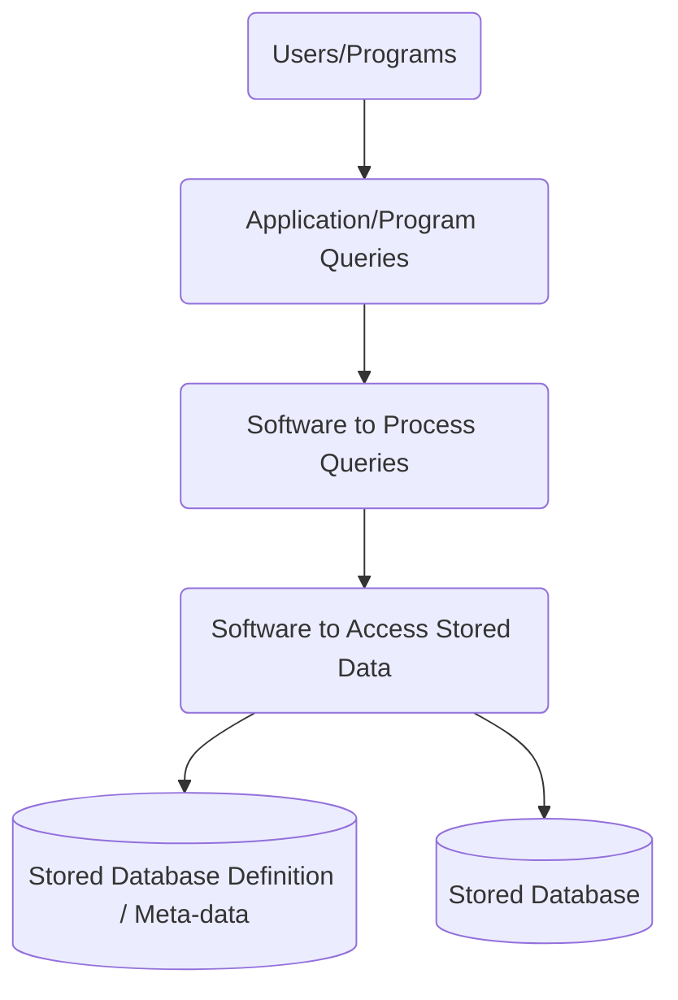

#diagram

```mermaid
flowchart TD
	id1(Users/Programs)
	id2(Application/Program Queries)
	id3(Software to Process Queries)
	id4(Software to Access Stored Data)
	id5[(Stored Database Definition / Meta-data)]
	id6[(Stored Database)]


	id1 --> id2
	id2 --> id3
	id3 --> id4
	id4 --> id5
	id4 --> id6

```

![[Screenshot 2025-01-28 at 9.50.56 AM.png]]