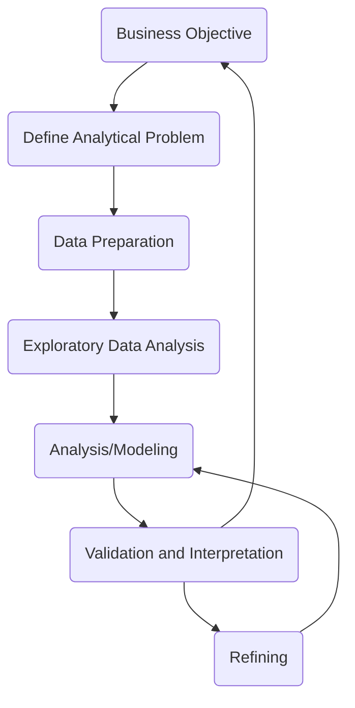

#diagram 

```mermaid
flowchart TD
	id1(Business Objective)
	id2(Define Analytical Problem)
	id3(Data Preparation)
	id4(Exploratory Data Analysis)
	id5(Analysis/Modeling)
	id6(Validation and Interpretation)
	id7(Refining)

	id1 --> id2
	id2 --> id3
	id3 --> id4
	id4 --> id5
	id5 --> id6
	id7 --> id5
	id6 --> id7
	id6 --> id1	

```
